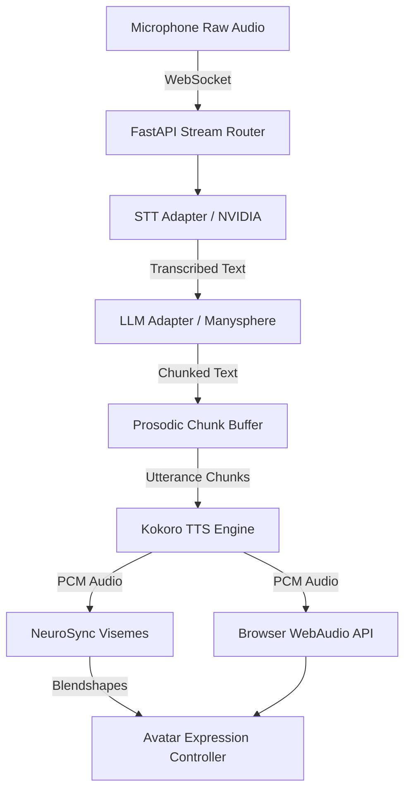

# Alicia — Real-Time AI Digital Human

Alicia is a real-time conversational AI digital human architected for ultra-low latency response cycles (<500ms typical text turnaround) and dynamic, embodied interaction. Unlike traditional rigid virtual assistants, Alicia seamlessly combines streaming speech recognition, instantaneous intelligence routing, split-stream synthesized voice, and procedurally generated non-verbal communication (micro-expressions, breathing algorithms, face-tracking movement).

## Demo
[Watch the Alicia V2 Interactive Demo on YouTube](https://youtu.be/0CS7i-2NGbg)

Or read more about the demo architecture [here](docs/demo/README.md).

---

## Overview

Alicia acts as a real-time conversational AI digital human combining:
* Streaming external speech recognition (ASR)
* Streaming Large Language Model responses via Any API
* High-Fidelity Kokoro / Qwen TTS pipeline
* Real-time audio-driven lip synchronization (NeuroSync)
* Browser-based Three.js / VRM 3D avatar rendering
* Lifelike organic idle behavior (Micro-breathing, procedural animation, eye-tracking) 
* Custom WebSockets low-latency streaming pipeline protocol

---

## Architecture



## Features

* **Low-Latency Streaming:** Implements a direct binary streaming chunking protocol connecting the LLM output buffer into text-to-speech generators. 
* **Organic Idle Animations:** When not speaking, Alicia tracks user mouse inputs via camera gaze hooks, utilizes procedural biological multi-harmonic respiratory functions via VRM bone orientations, and randomly implements conversational eye-contact breaks.
* **Cinematic Camera System:** The viewport employs dynamic FOV compression, Dolly tracking based on conversational states (`IDLE`, `SPEAKING`, `LISTENING`), and micro-breathing Lissajous drift for a natural framing experience.
* **Plug & Play Extensibility:** The backend architecture utilizes `core.interfaces.*` adapters allowing rapid drop-in replacements for TTS (Kokoro/Qwen), LLMs (OpenAI, Anthropic, Qwen, local Ollama), and Speech-to-Text inference blocks.

## Running V2 / Setup

### 1. Avatar Model Initialization
The system defaults to expecting a `.vrm` standard avatar format at `frontend/public/avatar.vrm`. Replace this file with any VRM (such as your own exports from VRoid Studio) to immediately hot-swap her appearance!

### 2. Service Dependencies and API Requirements
Alicia requires a pipeline of interconnected remote and local sub-services:
* **LLM (ManySphere):** A fast Large Language Model endpoint router. Configured mostly remotely needing `MANYSPHERE_API_KEY`.
* **ASR (NVIDIA NeMo):** High-fidelity transcription via `NVIDIA_API_KEY` (or compatible OpenAI replacements).
* **TTS Engine (Kokoro):** Required to be running LOCALLY at `http://127.0.0.1:8090/v1/audio/speech`. See [Kokoro-82M deployments](https://huggingface.co/hexgrad/Kokoro-82M).
* **NeuroSync (Lip Sync Daemon):** Required to be running LOCALLY at `http://127.0.0.1:5000/audio_to_blendshapes` to perform localized Audio-to-Blendshape inference in real-time. Ensure this backend is hot before dialing Alicia!

Configure these inside `.env` utilizing `.env.example` as a template!

### 3. Start the Backend API Pipeline

```bash
cd backend
python -m venv venv
venv\Scripts\activate # Windows
pip install -r requirements.txt

uvicorn main:app --reload --port 8000
```
### 4. Start the Frontend Rendering Engine

```bash
cd frontend
npm install
npm run dev
```

### 5. Open Browser

Navigate to **http://localhost:5173/**.

## How to Talk to Alicia

1. Allow Microphone access when prompted by the browser. 
2. Click **"Talk to Alicia"**. The immersive cinematic camera will dolly-zoom, Alicia will stop working at her desk, and turn around to acknowledge you.
3. Simply speak directly into your microphone. Let the interaction guide you!
4. Click **End Conversation** when you wish to dismiss her back to her routine.

---

## Known V2 Limitations
- **Interruptability Thresholds:** Alicia currently processes turn-taking via a rigid VAD (Voice Activity Detection) `EOS` (End-of-stream) broadcast. Full duplex conversational barging (interrupting her whilst speaking mid-sentence) is experimentally supported but occasionally clips animation loop-backs.
- **Microphone Echo Cancellation:** Standard browser media audio bridges are utilized; harsh environmental feedback loops may occasionally spoof her own TTS output back into her transcription engine if you do not use headphones on high-volume.

## Security

* **Never commit `.env`!** 
* **Use `.env.example` as your template.**
* The current repo contains an exclusion protocol ensuring `.env` files stay in your local runtime boundary securely.
