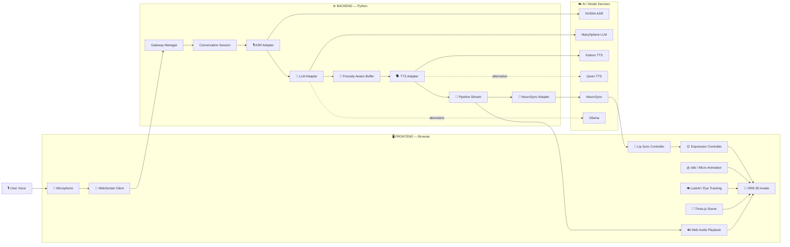

# ✨ Alicia — Real-Time AI Digital Human

<p align="center">
  <strong>A real-time conversational AI digital human with streaming intelligence, speech, lip synchronization, facial animation, and an embodied 3D VRM avatar.</strong>
</p>

<p align="center">
  <a href="https://youtu.be/0CS7i-2NGbg">
    
  </a>
</p>

<p align="center">
  <a href="https://youtu.be/0CS7i-2NGbg">
    ▶️ <strong>Watch Alicia V2 Demo</strong>
  </a>
</p>

<p align="center">
  
  
  
  
  
  
</p>

---

## 🧠 What is Alicia?

**Alicia** is a real-time conversational AI digital human designed to make AI interaction feel more like communicating with an embodied human rather than interacting with a traditional chatbot.

The system combines:

* 🎙️ Streaming speech recognition
* 🧠 Streaming LLM inference
* 🗣️ Streaming text-to-speech
* 🎧 Real-time audio playback
* 👄 Audio-driven lip synchronization
* 😊 Facial expressions and emotional states
* 👁️ Eye tracking and gaze behavior
* 🫁 Procedural breathing and micro-movements
* 🧍 Natural idle and conversational body animation
* 🌐 Browser-based 3D rendering
* ⚡ WebSocket-based streaming communication
* 🧩 Modular AI provider architecture

The result is a complete **voice → intelligence → speech → animation → digital human** pipeline running in real time.

---

# 🎬 Demo

### Alicia — AI Executive Receptionist

Click the image below to watch the complete V2 demonstration:

<p align="center">
  <a href="https://youtu.be/0CS7i-2NGbg">
    
  </a>
</p>

**▶️ [Watch the full Alicia V2 demonstration on YouTube](https://youtu.be/0CS7i-2NGbg)**

Alicia is currently presented as an **AI Executive Receptionist** operating in a virtual Dubai DIFC environment.

---

# 🏗️ System Architecture

Alicia is built as a distributed streaming system rather than a traditional request/response chatbot.



---

# 🔄 End-to-End Conversation Pipeline

```text
┌─────────────────────────────────────────────────────────────┐
│                        USER                                  │
│                 🎙️ Speaks into microphone                   │
└──────────────────────────┬──────────────────────────────────┘
                           │
                           ▼
┌─────────────────────────────────────────────────────────────┐
│                    FRONTEND                                  │
│              Browser Microphone Capture                     │
│                 Web Audio / WebSocket                       │
└──────────────────────────┬──────────────────────────────────┘
                           │ Audio Stream
                           ▼
┌─────────────────────────────────────────────────────────────┐
│                    FASTAPI BACKEND                           │
│                  WebSocket Gateway                           │
└──────────────────────────┬──────────────────────────────────┘
                           │
                           ▼
┌─────────────────────────────────────────────────────────────┐
│                       ASR                                   │
│              NVIDIA Speech Recognition                      │
└──────────────────────────┬──────────────────────────────────┘
                           │ Transcript
                           ▼
┌─────────────────────────────────────────────────────────────┐
│                       LLM                                   │
│                  ManySphere / Ollama                         │
│                 Streaming Token Generation                   │
└──────────────────────────┬──────────────────────────────────┘
                           │ Token Stream
                           ▼
┌─────────────────────────────────────────────────────────────┐
│              PROSODY-AWARE TEXT BUFFER                       │
│                                                             │
│   Sentence boundaries                                        │
│   Punctuation boundaries                                     │
│   Semantic boundaries                                        │
│   Word-boundary protection                                   │
│   Adaptive fallback buffering                                │
└──────────────────────────┬──────────────────────────────────┘
                           │ Natural speech chunks
                           ▼
┌─────────────────────────────────────────────────────────────┐
│                       TTS                                   │
│                  Kokoro / Qwen TTS                           │
└──────────────────────────┬──────────────────────────────────┘
                           │ PCM Audio
                           ▼
              ┌────────────┴────────────┐
              ▼                         ▼
┌──────────────────────────┐  ┌──────────────────────────────┐
│     WEB AUDIO            │  │          NEUROSYNC           │
│     PLAYBACK             │  │     Audio → Blendshapes     │
└────────────┬─────────────┘  └──────────────┬───────────────┘
             │                               │
             │                               ▼
             │                   ┌───────────────────────────┐
             │                   │   VRM EXPRESSIONS         │
             │                   │   Lip / Face Animation    │
             │                   └─────────────┬─────────────┘
             │                                 │
             └────────────────┬────────────────┘
                              ▼
                 ┌───────────────────────────┐
                 │      ALICIA AVATAR         │
                 │                            │
                 │  👄 Lip Sync               │
                 │  😊 Expressions            │
                 │  👁️ Eye Movement           │
                 │  🫁 Breathing              │
                 │  🧍 Body Animation         │
                 └───────────────────────────┘
```

---

# ⚙️ Backend Architecture

The backend is responsible for orchestration, streaming, conversation state, AI provider abstraction, TTS chunking, and real-time communication.

### Backend Stack

<p>


</p>

### Backend Pipeline

```text
                    ┌─────────────────────┐
                    │   WebSocket Client  │
                    └──────────┬──────────┘
                               │
                               ▼
                    ┌─────────────────────┐
                    │   FastAPI Gateway   │
                    └──────────┬──────────┘
                               │
                               ▼
                    ┌─────────────────────┐
                    │ ConversationManager │
                    └──────────┬──────────┘
                               │
                 ┌─────────────┼─────────────┐
                 ▼             ▼             ▼
              Session       State       Transcript
                 │
                 ▼
          ┌───────────────┐
          │      ASR      │
          │ NVIDIA Adapter│
          └───────┬───────┘
                  │
                  ▼
          ┌───────────────┐
          │      LLM      │
          │  ManySphere   │
          │    Ollama     │
          └───────┬───────┘
                  │ Streaming tokens
                  ▼
          ┌────────────────────┐
          │ Prosody Buffer     │
          │                    │
          │ • punctuation      │
          │ • semantic bounds  │
          │ • word protection  │
          │ • timeout fallback │
          └─────────┬──────────┘
                    │
                    ▼
          ┌────────────────────┐
          │       TTS          │
          │ Kokoro / Qwen      │
          └─────────┬──────────┘
                    │
             ┌──────┴──────┐
             ▼             ▼
          PCM Audio     NeuroSync
             │             │
             ▼             ▼
          Browser       Blendshapes
```

### Backend Components

| Component             | Responsibility                        |
| --------------------- | ------------------------------------- |
| `FastAPI`             | HTTP/WebSocket server                 |
| `GatewayManager`      | Connection and pipeline orchestration |
| `ConversationManager` | Conversation lifecycle                |
| `Session`             | Per-user conversation state           |
| `SessionState`        | Runtime state management              |
| `TranscriptStore`     | Conversation transcript handling      |
| `PipelineStream`      | Streaming data pipeline               |
| `StreamBus`           | Event/packet transport                |
| `StreamPacket`        | Typed streaming messages              |
| `TurnProfiler`        | Latency and pipeline measurements     |
| `ManySphere Adapter`  | Streaming LLM integration             |
| `NVIDIA Adapter`      | Speech recognition / NVIDIA services  |
| `Kokoro Adapter`      | Low-latency TTS                       |
| `Qwen TTS Adapter`    | Alternative TTS backend               |
| `Ollama Adapter`      | Local LLM alternative                 |
| `NeuroSync Adapter`   | Audio-to-avatar animation bridge      |

---

# 🧩 Provider Architecture

Alicia uses an adapter-oriented backend architecture so AI providers can be replaced without rewriting the conversation pipeline.

```text
                    Core Interfaces
                         │
          ┌──────────────┼──────────────┐
          │              │              │
          ▼              ▼              ▼
        ASR             LLM            TTS
          │              │              │
     ┌────┴────┐    ┌────┴─────┐   ┌────┴─────┐
     │ NVIDIA  │    │ManySphere│   │ Kokoro   │
     │         │    │          │   │          │
     └─────────┘    │ Ollama   │   │ Qwen TTS │
                    └──────────┘   └──────────┘
```

This allows the same conversational infrastructure to support different model providers.

---

# 🎨 Frontend Architecture

The frontend is a browser-based real-time 3D environment built around **Three.js + TypeScript + VRM**.

### Frontend Stack

<p>


</p>

### Frontend Pipeline

```text
                 Browser
                    │
                    ▼
             ┌───────────────┐
             │ Three.js      │
             │ Renderer      │
             └───────┬───────┘
                     │
         ┌───────────┼───────────┐
         ▼           ▼           ▼
      Camera       Scene       Lighting
         │           │           │
         └───────────┼───────────┘
                     ▼
              ┌──────────────┐
              │  VRM Loader  │
              └──────┬───────┘
                     │
                     ▼
              ┌──────────────┐
              │ Avatar Model │
              └──────┬───────┘
                     │
        ┌────────────┼────────────┐
        ▼            ▼            ▼
   Expressions     LookAt       Animation
        │            │            │
        ▼            ▼            ▼
   Face State    Eye Tracking   Body Motion
        │
        ▼
   ┌────────────────────────────┐
   │     Speech Animation       │
   │                            │
   │  Audio → NeuroSync → VRM  │
   └──────────────┬─────────────┘
                  │
                  ▼
          ┌───────────────┐
          │ Alicia Avatar │
          └───────────────┘
```

---

# 🧍 Digital Human Animation System

Alicia is not simply a static 3D model.

The frontend contains multiple animation layers that work simultaneously.

### 👄 Speech

* Real-time audio playback
* Audio-driven lip synchronization
* NeuroSync blendshape processing
* Speech animation state management

### 😊 Facial Behavior

* Expression controller
* Emotional expression states
* Eye behavior
* Blink controller
* Look-at system
* Conversational gaze

### 🫁 Non-Verbal Animation

* Procedural breathing
* Micro body movement
* Idle animation
* Listening posture
* Speaking posture
* Executive hand/body behavior
* Conversational state transitions

### 🎥 Camera

* Three.js camera system
* Cinematic framing
* Conversation-state-aware camera behavior
* Fixed default presentation framing
* User-controlled view reset

---

# 🌆 3D Environment

Alicia is presented inside a virtual **Dubai DIFC executive reception environment**.

The environment includes:

* 🏢 Night-time city environment
* 🌴 Decorative vegetation
* 🪑 Reception furniture
* 🏢 Executive reception desk
* 💡 Scene lighting
* 🎥 Cinematic camera composition
* 🧍 Interactive VRM character
* 🖥️ Real-time status UI
* 🎙️ Conversation controls

---

# 🛠️ Technology Stack

## Artificial Intelligence

| Technology                     | Role                                               |
| ------------------------------ | -------------------------------------------------- |
| **ManySphere**                 | Streaming LLM inference                            |
| **NVIDIA AI / NeMo ecosystem** | Speech recognition / AI services                   |
| **Kokoro-82M**                 | Primary local TTS pipeline                         |
| **Qwen TTS**                   | Alternative TTS provider                           |
| **Ollama**                     | Local LLM provider                                 |
| **NeuroSync**                  | Real-time audio-to-animation / lip synchronization |

## Backend

| Technology           | Role                             |
| -------------------- | -------------------------------- |
| Python               | Core backend language            |
| FastAPI              | API and WebSocket server         |
| WebSockets           | Real-time communication          |
| HTTPX                | Async external API communication |
| Pydantic             | Data validation and models       |
| AsyncIO              | Concurrent streaming             |
| Adapter Architecture | Provider abstraction             |

## Frontend

| Technology         | Role                               |
| ------------------ | ---------------------------------- |
| TypeScript         | Frontend application               |
| Vite               | Frontend development/build tooling |
| Three.js           | 3D rendering                       |
| VRM                | Avatar format                      |
| `@pixiv/three-vrm` | VRM runtime integration            |
| Web Audio API      | Real-time audio playback           |
| WebSocket API      | Backend streaming                  |
| HTML/CSS           | Interface and presentation         |

## Development & Infrastructure

| Technology           | Role                           |
| -------------------- | ------------------------------ |
| Git                  | Version control                |
| GitHub               | Source hosting                 |
| npm                  | Frontend dependency management |
| Python venv          | Backend environment isolation  |
| VS Code              | Development environment        |
| NVIDIA API           | Cloud AI services              |
| Local model services | TTS / lip-sync processing      |

---

# 📁 Project Structure

```text
digital-human-v2/
│
├── README.md
├── .env.example
├── .gitignore
│
├── backend/
│   ├── main.py
│   ├── requirements.txt
│   │
│   ├── api/
│   │   └── conversation.py
│   │
│   ├── adapters/
│   │   ├── kokoro_tts/
│   │   ├── manysphere/
│   │   ├── neurosync/
│   │   ├── nvidia/
│   │   ├── ollama/
│   │   └── qwen_tts/
│   │
│   ├── config/
│   │
│   ├── core/
│   │   ├── conversation/
│   │   ├── profiler/
│   │   └── streaming/
│   │
│   └── services/
│       └── gateway/
│
├── frontend/
│   ├── package.json
│   ├── index.html
│   │
│   ├── public/
│   │   └── avatar.vrm
│   │
│   └── src/
│       ├── audio/
│       ├── avatar/
│       │   ├── animation/
│       │   └── controllers/
│       ├── camera/
│       ├── character/
│       ├── controls/
│       ├── lighting/
│       ├── renderer/
│       └── scene/
│
└── docs/
    ├── NEUROSYNC_RESEARCH.md
    ├── RELEASE_AUDIT.md
    ├── V2_RELEASE_READINESS.md
    └── demo/
        ├── README.md
        └── alicia-demo-thumbnail.png
```

---

# 🚀 Running Alicia V2

## Prerequisites

* Python 3.10+
* Node.js 18+
* npm
* A modern Chromium-based browser
* NVIDIA API credentials
* ManySphere API credentials
* Local Kokoro TTS service
* Local NeuroSync service

---

## 1. Clone

```bash
git clone https://github.com/hetshahAI/digital-human-v2.git
cd digital-human-v2
```

---

## 2. Configure Environment

Copy:

```text
.env.example
```

to:

```text
.env
```

Configure the required API keys and local service endpoints.

**Never commit `.env`.**

---

## 3. Start Kokoro

Alicia expects Kokoro TTS at:

```text
http://127.0.0.1:8090/v1/audio/speech
```

Start your local Kokoro service before starting the conversation pipeline.

---

## 4. Start NeuroSync

Alicia expects the NeuroSync service at:

```text
http://127.0.0.1:5000/audio_to_blendshapes
```

This service converts speech audio into animation/blendshape information used by the VRM avatar.

---

## 5. Start Backend

```bash
cd backend

python -m venv venv
```

### Windows

```bash
venv\Scripts\activate
```

### Linux / macOS

```bash
source venv/bin/activate
```

Install dependencies:

```bash
pip install -r requirements.txt
```

Start FastAPI:

```bash
uvicorn main:app --reload --port 8000
```

---

## 6. Start Frontend

Open another terminal:

```bash
cd frontend
npm install
npm run dev
```

---

## 7. Open Alicia

Open:

```text
http://localhost:5173
```

Allow microphone access and start the conversation.

---

# 🧍 Custom Avatar

Alicia uses the VRM avatar located at:

```text
frontend/public/avatar.vrm
```

To use another compatible VRM avatar, replace the file while keeping the same filename:

```text
avatar.vrm
```

The rest of the animation and rendering pipeline can remain unchanged.

---

# ⚡ Streaming & Latency Design

The system is designed around **streaming instead of waiting for complete responses**.

Traditional architecture:

```text
User
 ↓
Speech → Complete Transcript
 ↓
Complete LLM Response
 ↓
Complete TTS
 ↓
Audio
```

Alicia:

```text
User
 ↓
Streaming ASR
 ↓
Streaming LLM tokens
 ↓
Prosody-aware text buffering
 ↓
Streaming TTS chunks
 ↓
Immediate PCM playback
 ↓
Real-time lip synchronization
```

This allows the system to begin producing speech before the complete response has been generated.

The project specifically avoids excessively aggressive text flushing because extremely small TTS chunks can destroy natural conversational prosody.

---

# 🧠 Prosody-Aware TTS Chunking

Alicia's TTS buffer considers linguistic boundaries instead of blindly sending individual tokens to the speech engine.

The buffer considers:

* Sentence-ending punctuation
* Pause punctuation
* Word boundaries
* Semantic boundary safety
* Conjunctions
* Pronouns
* Prepositions
* Minimum chunk sizes
* Adaptive fallback timing

The objective is to balance:

```text
        LATENCY
           ▲
           │
           │
           │
           └──────────────► NATURALNESS
```

Rather than optimizing latency at the cost of robotic speech.

---

# 🔌 Local Service Architecture

```text
                         INTERNET
                            │
                     ┌──────▼──────┐
                     │ ManySphere  │
                     │     LLM     │
                     └──────┬──────┘
                            │
                            ▼
┌─────────────────────────────────────────────────────┐
│                    LOCAL MACHINE                    │
│                                                     │
│  ┌──────────────┐        ┌──────────────────────┐   │
│  │ FastAPI      │───────►│ Kokoro TTS           │   │
│  │ Port 8000    │        │ Port 8090            │   │
│  └──────┬───────┘        └──────────────────────┘   │
│         │                                           │
│         │              ┌──────────────────────┐     │
│         └─────────────►│ NeuroSync            │     │
│                        │ Port 5000             │     │
│                        └──────────┬───────────┘     │
│                                   │                 │
└───────────────────────────────────┼─────────────────┘
                                    │
                                    ▼
                           Browser / VRM Avatar
```

---

# 🔐 Security

Never commit:

```text
.env
API keys
Bearer tokens
private credentials
local secrets
runtime logs
model caches
```

Use:

```text
.env.example
```

as the public configuration template.

---

# ⚠️ Known V2 Limitations

* Full conversational interruption/barging remains an area for future improvement.
* Browser microphone echo can affect ASR when speakers are used at high volume.
* Kokoro and NeuroSync currently require local services.
* The complete pipeline depends on multiple external/local services being available.
* TTS chunking prioritizes natural speech cadence rather than blindly minimizing every possible millisecond.
* Performance depends on the user's browser, CPU, network, and local model-service performance.

---

# 🗺️ Future Direction

Alicia V2 establishes the foundation for a more general **AI Digital Human Platform**.

Potential future directions include:

* 🌍 Multilingual digital humans
* 😊 Richer emotional state modeling
* 👄 Improved facial animation
* 🗣️ More expressive TTS
* 🎙️ Full-duplex conversation
* ⚡ Improved interruption handling
* 🧠 Long-term conversational memory
* 🧑‍💼 Multiple professional AI personas
* 🏢 Custom enterprise environments
* 🔌 Additional LLM/TTS/ASR providers
* ☁️ Cloud deployment
* 🧩 Multi-agent digital humans

---

# 👨‍💻 Author

**Het Shah**

AI Engineer & Developer
Building real-time AI agents, digital humans, and intelligent automation systems.

GitHub: **[@hetshahAI](https://github.com/hetshahAI)**

---

# ⭐ Support the Project

If you find Alicia interesting, consider giving the repository a ⭐ on GitHub.

The project is an ongoing exploration of how **LLMs, real-time voice AI, 3D avatars, and procedural animation** can be combined into a single conversational digital human.

<p align="center">
  <strong>AI that doesn't just answer — it communicates.</strong>
</p>
